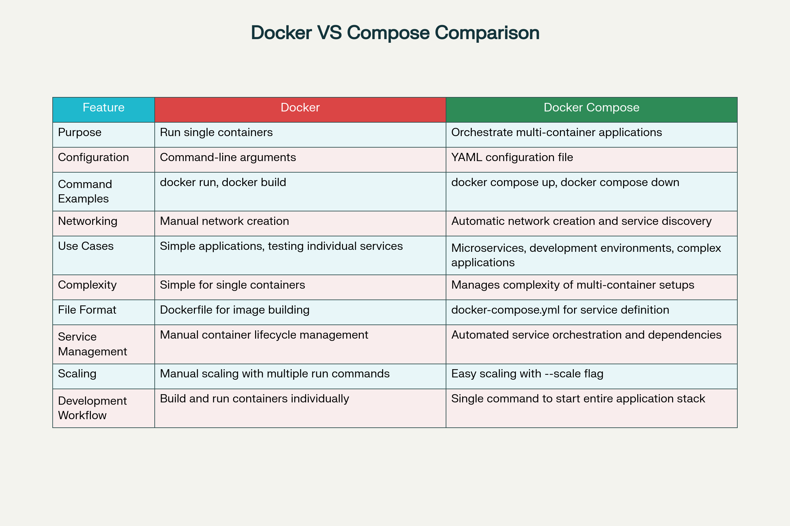

# Docker compose

## Docker Compose Demonstration with Example Voting App <a href="#docker-compose-demonstration-with-example-voting-a" id="docker-compose-demonstration-with-example-voting-a"></a>

### What is Docker Compose? <a href="#what-is-docker-compose" id="what-is-docker-compose"></a>

Docker Compose is a **powerful tool for defining and running multi-container Docker applications**. Instead of manually managing individual containers with complex `docker run` commands, Docker Compose allows you to define your entire application stack in a single YAML file and manage all services with simple commands.

**Key Characteristics:**

* **Declarative Configuration**: Define services, networks, and volumes in a human-readable YAML format
* **Multi-Container Orchestration**: Manage interconnected services as a single unit
* **Simplified Workflow**: Start, stop, and rebuild your entire application with single commands
* **Environment Consistency**: Ensure identical setups across development, testing, and production

<figure><figcaption></figcaption></figure>

### Why Use Docker Compose? <a href="#why-use-docker-compose" id="why-use-docker-compose"></a>

### **Primary Benefits**

**Simplified Multi-Container Management**\
Docker Compose transforms complex container orchestration into a straightforward process. Rather than remembering lengthy `docker run` commands with multiple parameters, you define everything once in a YAML file.

**Rapid Development Workflow**\
Compose caches configurations and reuses existing containers when services haven't changed, enabling quick environment updates. Developers can spin up complete application stacks instantly, eliminating "it works on my machine" problems.

**Consistent Environments**\
The same YAML configuration works across all environments - development, staging, and production - with variations handled through environment variables or override files.

**Automatic Networking and Service Discovery**\
Compose creates isolated networks automatically, allowing containers to communicate by service name while remaining secure from external access.

### **Resource Efficiency**

**Infrastructure Optimization**\
Host multiple isolated environments on a single machine, eliminating infrastructure overhead. Container reuse and configuration caching contribute to efficient resource utilization.

**DevOps Integration**\
Docker Compose fosters consistency and reproducibility, making it ideal for CI/CD pipelines and automated testing environments.

### Real-Time Use Cases <a href="#real-time-use-cases" id="real-time-use-cases"></a>

### **1. Development Environments**

**Local Development Setup**\
Developers use Docker Compose to replicate production-like environments locally. A typical web application stack might include:

* Web server (nginx/apache)
* Application server (Node.js/Python/PHP)
* Database (PostgreSQL/MySQL)
* Cache layer (Redis)
* Background workers

**Example Scenario**: An e-commerce platform requiring multiple microservices for user management, inventory, payments, and notifications can be started with a single `docker compose up` command.

### **2. Microservices Architecture**

**Service Isolation and Communication**\
Each microservice runs in its own container with dedicated resources and dependencies, preventing conflicts and enabling independent scaling.

**Benefits for Microservices:**

* **Polyglot Development**: Services can use different programming languages and frameworks
* **Independent Scaling**: Scale specific services based on demand
* **Fault Isolation**: If one service crashes, others continue running
* **Team Independence**: Different teams can develop and deploy services independently

### **3. Testing and CI/CD Pipelines**

**Automated Testing Environments**\
Create isolated, reproducible test environments for:

* Integration testing
* End-to-end testing
* Performance testing
* Security testing

**Continuous Integration**\
CI/CD systems use Docker Compose to:

* Spin up test databases and dependencies
* Run automated test suites
* Generate consistent build environments
* Deploy to staging environments

### **4. Production Deployments**

**Single Host Deployments**\
For smaller applications, Docker Compose provides an excellent production solution with:

* Service health checks
* Restart policies
* Resource limits
* Environment-specific configurations

**Multi-Environment Support**\
Use multiple compose files for different environments:

```
docker compose -f docker-compose.yml -f docker-compose.prod.yml up -d
```

### **5. Educational and Training**

**Learning Containerization**\
Docker Compose serves as an excellent tool for teaching:

* Container orchestration concepts
* Microservices architecture
* DevOps practices
* Application deployment methodologies

### Detailed Demonstration with Example Voting App <a href="#detailed-demonstration-with-example-voting-app" id="detailed-demonstration-with-example-voting-app"></a>


```
https://github.com/nimbuswiztech/example-voting-app
```


<figure><figcaption></figcaption></figure>

Architecture diagram of a containerized voting app with Python, Redis, .NET worker, PostgreSQL, and Node.js services&#x20;

The example voting app demonstrates a **distributed application across multiple Docker containers**, showcasing real-world microservices architecture.

### **Application Architecture Overview**

The voting application consists of **five key components**:

1. **Vote App (Python/Flask)**: Frontend for casting votes
2. **Redis**: Message queue collecting new votes
3. **Worker (.NET)**: Processes votes and stores them in database
4. **PostgreSQL**: Persistent database storage
5. **Result App (Node.js)**: Real-time results display

### **Prerequisites**

Before starting the demonstration:

```
# Verify Docker installation
docker --version

# Verify Docker Compose installation  
docker compose version

# Clone the repository
git clone https://github.com/nimbuswiztech/example-voting-app
cd example-voting-app
```

### **Step 1: Repository Structure Exploration**

Examine the project structure:

```
ls -la
```

**Key Files and Directories:**

* `vote/` - Python voting application source code
* `result/` - Node.js results application source code
* `worker/` - .NET worker application source code
* `docker-compose.yml` - Multi-container application definition
* `docker-stack.yml` - Docker Swarm deployment configuration
* `k8s-specifications/` - Kubernetes deployment files

### **Step 2: Understanding the Docker Compose Configuration**

**Typical docker-compose.yml structure for the voting app:**

```
textversion: '3'
services:
  redis:
    image: redis:alpine
    networks:
      - back-tier

  db:
    image: postgres:15-alpine
    environment:
      POSTGRES_USER: postgres
      POSTGRES_PASSWORD: postgres
    volumes:
      - db-data:/var/lib/postgresql/data
    networks:
      - back-tier

  vote:
    build: ./vote
    ports:
      - "8080:80"
    depends_on:
      - redis
    networks:
      - front-tier
      - back-tier

  worker:
    build: ./worker
    depends_on:
      - redis
      - db
    networks:
      - back-tier

  result:
    build: ./result
    ports:
      - "8081:80"  
    depends_on:
      - db
    networks:
      - front-tier
      - back-tier

volumes:
  db-data:

networks:
  front-tier:
  back-tier:
```

### **Step 3: Building and Running the Application**

**1. Build the Application Images:**

```
# Build all services defined in docker-compose.yml
docker compose build
```

This command:

* Builds custom images for vote, worker, and result services
* Pulls pre-built images for Redis and PostgreSQL
* Creates application-specific images with dependencies

**2. Start the Complete Application Stack:**

```
# Start all services in detached mode
docker compose up -d
```

Expected output:

```
textCreating network "example-voting-app_front-tier" ... done
Creating network "example-voting-app_back-tier" ... done
Creating volume "example-voting-app_db-data" ... done
Creating example-voting-app_redis_1 ... done
Creating example-voting-app_db_1    ... done
Creating example-voting-app_vote_1   ... done
Creating example-voting-app_worker_1 ... done
Creating example-voting-app_result_1 ... done
```

**3. Verify Service Status:**

```
# Check running containers
docker compose ps
```

### **Step 4: Application Interaction and Testing**

**Access the Applications:**

1. **Voting Interface**: Open `http://localhost:8080`
   * Cast votes between two options (typically "Cats vs Dogs")
   * Each browser session allows one vote only
2. **Results Interface**: Open `http://localhost:8081`
   * View real-time voting results
   * Results update immediately as votes are cast

**Test the Complete Workflow:**

1. Vote on the voting page
2. Observe immediate result updates on the results page
3. Verify data persistence by restarting services

### **Step 5: Service Management Operations**

**Individual Service Management:**

```
# Scale specific services
docker compose up -d --scale vote=3

# Stop specific service
docker compose stop vote

# Start specific service  
docker compose start vote

# View service logs
docker compose logs vote
docker compose logs -f result  # Follow logs in real-time
```

**Health Monitoring:**

```
# Monitor resource usage
docker compose top

# View detailed service information
docker compose config

# Check service health
docker compose ps --services
```

### **Step 6: Advanced Compose Operations**

**Environment-Specific Configurations:**

Create `docker-compose.override.yml` for development:

```
version: '3'
services:
  vote:
    volumes:
      - ./vote:/usr/local/app
    environment:
      - FLASK_DEBUG=1
      
  result:
    volumes:
      - ./result:/usr/local/app
```

**Production Configuration:**

Create `docker-compose.prod.yml`:

```
version: '3'
services:
  vote:
    restart: always
    deploy:
      replicas: 2
      
  result:
    restart: always
    deploy:
      replicas: 2
```

**Deploy with specific configuration:**

```
# Development with hot-reload
docker compose -f docker-compose.yml -f docker-compose.override.yml up -d

# Production deployment  
docker compose -f docker-compose.yml -f docker-compose.prod.yml up -d
```

### **Step 7: Debugging and Troubleshooting**

**Common Debugging Commands:**

```
# View all logs
docker compose logs

# Debug specific service issues
docker compose logs --tail=50 worker

# Execute commands in running containers
docker compose exec vote bash
docker compose exec db psql -U postgres

# Inspect network configuration
docker network ls
docker network inspect example-voting-app_back-tier
```

**Troubleshooting Scenarios:**

1. **Service Won't Start**: Check dependencies and port conflicts
2. **Database Connection Issues**: Verify environment variables and network connectivity
3. **Vote Not Registering**: Check Redis connectivity and worker service logs
4. **Results Not Updating**: Verify database connectivity and worker processing

### **Step 8: Scaling and Performance Testing**

**Horizontal Scaling:**

```
# Scale voting frontend for load handling
docker compose up -d --scale vote=5

# Scale worker processes for vote processing
docker compose up -d --scale worker=3

# Monitor scaled services
docker compose ps
```

**Load Testing Setup:**

```
# Install load testing tools in separate container
docker run --network example-voting-app_front-tier \
  --rm -it alpine/curl \
  sh -c "while true; do curl -X POST http://vote/; sleep 1; done"
```

### **Step 9: Cleanup and Resource Management**

**Graceful Shutdown:**

```
# Stop all services
docker compose stop

# Stop and remove containers, networks
docker compose down

# Remove volumes (caution: deletes data)
docker compose down --volumes

# Remove images
docker compose down --rmi all
```

**Resource Monitoring:**

```
# Check disk usage
docker system df

# Clean up unused resources
docker system prune

# Monitor container resource usage
docker stats
```


