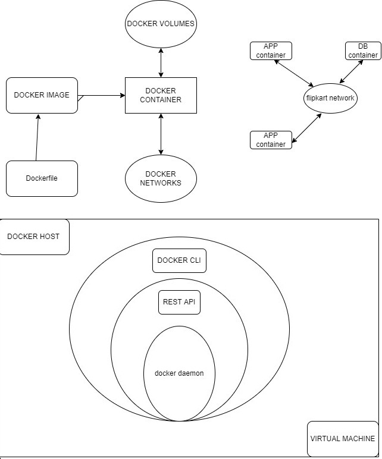

# Docker

## **What is Docker?**

[Docker](https://www.simplilearn.com/tutorials/docker-tutorial/getting-started-with-docker) is an open-source containerization platform. This Docker tool designed to make it easier to create, deploy and run application by using containers.

### **What is Container?**

Docker container is a standardized unit which can be create on the fly to deploy a particular application or environment.

It’s a running instance of an image. Container are writable.

### **What are Docker’s most notable features?**

Docker’s most essential features include:

* Application agility
* Developer productivity
* Easy modeling
* Operational efficiencies
* Placement and affinity
* Version control

### **Docker image**

Docker image is a package. that have everything to run an application.

Set of instruction stored in the form of layer. Each layer is read only.

### **Dockerfile:**

Dockerfile is a simple text file that consists of instructions layer by layer to build Docker images.

Docker can build images automatically by reading the instructions from a Dockerfile

**Containers Vs. Virtual Machine**

| **Virtual Machine**                         | **Containers**                           |
| ------------------------------------------- | ---------------------------------------- |
| Need more Resources                         | Need less Resources                      |
| Process isolation is done at Hardware level | Process isolation done at OS level       |
| Need to pre-allocate the memory             | Memory will be allocated automatically   |
| Separate OS for each VM                     | OS resources can be shared within docker |
| Take more time to create VM                 | Creation of container is very less       |
| \`Booting time is more                      | Booting time is less                     |

### **Docker Architecture**



.png>)

**Docker Host :** The machine that installed with the docker is called Docker Host

**Docker Daemon :** This is the process that started once we installed the docker

**Docker Client :** It is installed in remote server, command to access docker daemon

That manages, Images, Containers, Network, Volume

**Rest API :** It is the interface that the program can used to access docker daemon

Docker client and Daemon communicate through Rest API

### **Docker File**

Apache Server through a Dockerfile

<sup>Step 1: Create a directory for Apache server files</sup>

**mkdir apache\_folder**

<sup>Step 2: Building a Dockerfile</sup>

**vi Dockerfile**

```
FROM ubuntu
RUN apt update
RUN apt install –y apache2
RUN apt install –y apache2-utils
RUN apt clean
EXPOSE 80
CMD [“apache2ctl”, “-D”, “FOREGROUND”]
```

Step 3: Tag and build the Docker image

**`docker build -t apache_image:1.0 .`**

**docker images**

#### **REPOSITORY TAG IMAGE ID CREATED SIZE**

**`apache_image 1.0 a738dbef66ef 15 seconds ago 133MB`**

Step 4: Run the Docker image as a container

**`docker run --name myapache -d -p 80:80 apache_image:1.0`**

#### **docker ps**

```
CONTAINER ID IMAGE COMMAND CREATED STATUS PORTS NAMES
443848c30b74 apache_image:1.0 "/docker-entrypoint.…" 7 seconds ago Up 6 seconds 0.0.0.0:80->80/tcp myapache
```

Step 5: Review the online presence of Apache Server

.png>)

**Dockerfile Instructions**

Text document that contains all the commands to assemble an image

```

FROM — specifies the base (parent) image.
LABEL —provides metadata. Good place to include maintainer info.
ENV — sets a persistent environment variable.
RUN —runs a command and creates an image layer. Used to install packages into containers.
COPY — copies files and directories to the container.
ADD — copies files and directories to the container. Can upack local .tar files.
CMD — provides a command and arguments for an executing container. Parameters can be overridden. There can be only one CMD.
WORKDIR — sets the working directory for the instructions that follow.
ARG — defines a variable to pass to Docker at build-time.
ENTRYPOINT — provides command and arguments for an executing container. Arguments persist.
EXPOSE — exposes a port.
VOLUME — creates a directory mount point to access and store persistent data.
```

### **Docker Image:**

A Docker Image is a read-only file with a bunch of instructions. When these instructions are executed, it creates a Docker container.

A [Docker](https://www.techtarget.com/searchitoperations/definition/Docker) image is a file used to execute code in a Docker container. Docker images act as a set of instructions to build a Docker [container](https://www.techtarget.com/searchitoperations/definition/container-containerization-or-container-based-virtualization), like a template.

Docker is used to create, run and deploy applications in containers. A Docker image contains application code, libraries, tools, dependencies and other files needed to make an application run.

### **Docker Containers**

Containers are deployed applications bundled with all necessary dependencies and configuration files. All of the elements share the same OS kernel. Since the container isn’t tied to any one IT infrastructure, it can run on a different system or the cloud.

Docker container is a run state of Docker image. When we build an image and start running it; we are running in a container. Containers are instances of Docker images that can be run using the Docker run command. The basic purpose of Docker is to run containers.

### **Context**

This is the folder where it contains all the dependencies to create the image

Generally we define the context with ( . ) while we running the docker file

If the file related to create the image is present in other directory we will provide directory name instead of ( . )

### **Docker ignore**

It is the file which contains the files and directory names to which hides when we running the dockerfile

### **Dangling Image**

Dangling images are docker images without Repository and Tag name

How Dangling Images created ?

When we run the Docker file multiple times with same image name and without tag the oldest images will moved to dangling image

### **Docker Volume**

Volume in docker allows us to persist data after a container dies.

1. **Normal Volumes :** Are the volumes where we create using “docker volume create \<volume\_name>” and attaching to the container using volume name

```
$ docker volume create testvolume
```

```
$ docker run –id –name Jenkins –p 8080:8080 –p 5000:5000 jenkins:2.60.3-alpine –v 
```

```
testvolume:/var/Jenkins_home
```

1. **Bind mounts:** Create locally and attach to container we provide full path of volume

```
$ docker run –id –name Jenkins –p 8080:8080 –p 5000:5000 jenkins:2.60.3-alpine –v /home/ubuntu/docker testvolume:/var/Jenkins_home
```

1. **Anonymous Volume:** It will get created automatically when run the docker run command.

### **Docker Networking**

Containers can communicate with other containers and also with the Docker Host. Docker networking enables a user to link a Docker container to as many networks as requires. Docker Networks are used to provide complete isolation for Docker containers.

### **Network Drivers**

**Bridge:** The bridge network is a private default internal network created by docker on the host. So, all containers get an internal IP address and these containers can access each other, using this internal IP. The Bridge networks are usually used when your applications run in standalone containers that need to communicate.

.png>)

**Host**: This driver removes the network isolation between the docker host and the docker containers to use the host’s networking directly. So with this, you will not be able to run multiple web containers on the same host, on the same port as the port is now common to all containers in the host network.

.png>)

**None**: In this kind of network, containers are not attached to any network and do not have any access to the external network or other containers. So, this network is used when you want to completely disable the networking stack on a container and, only create a loopback device.

.png>)

**Overlay**: Creates an internal private network that spans across all the nodes participating in the swarm cluster.

.png>)

### **Docker Compose**

To understand Docker Compose, let’s look at Myntra as an example. Myntra is a fashion e-commerce website similar to Amazon. You visit the Myntra website through your web browser and go through several activities, like logging in to your account, browsing a catalog, checking out, and so on. Behind each of these activities or services are different products, such as an account database, product database, cart database, and others that run behind the scenes.

.jpeg>)

Each of these can be considered a microservice. The more microservices you build into your environment, the more valuable it is to have each of these services in their containers. But as a developer, you should be able to jump from one container to another. This is where you can relate this example to Docker, where Docker Compose can connect different containers as a single service.

Docker Compose is used for running multiple containers as a single service. Each of the containers here run in isolation but can interact with each other when required. Docker Compose files are very easy to write in a scripting language called YAML, which is an XML-based language that stands for Yet Another Markup Language. Another great thing about Docker Compose is that users can activate all the services (containers) using a single command.

**Docker Compose ─ Installation**

Step 1 − Download the necessary files from github using the following command&#x20;

`https://github.com/docker/compose/releases`

**`curl -L "https://github.com/docker/compose/releases/download/1.10.0-rc2/dockercompose`**

**`-$(uname -s) -$(uname -m)" -o /home/demo/docker-compose`**

To the binary, apply for the executable permissions.

**`sudo chmod +x /usr/local/bin/docker-compose`**

**`docker-compose –version`**

### **Creating Your First Docker-Compose File**

**`sudo vim docker-compose.yml`**

```
Version: ‘z’
Services:
Databases:
Image: mysql
Ports:
-“3306:3306”
Environment:
-MYSQL ROOT PASSWORD=password
-MYSQL_USER=user
-MYSQL_PASSWORD=password
-MYSQL DATABASE=demodb
Web:
Image: nginx
```

* The **database** and **web** keyword are used to define two separate services. One will be running our **mysql** database and the other will be our **nginx** web server.
* The **image** keyword is used to specify the image from **dockerhub** for our **mysql** and **nginx** containers

### **Docker Swarm**

Docker Swarm is a native tool used to orchestrate Docker containers. It enables you to manage a cluster of hosts as a single resource pool.

[Docker Swarm](https://www.aquasec.com/cloud-native-academy/docker-container/docker-swarm/) makes use of overlay networks for inter-host communication. The swarm manager service is responsible for automatically assigning IP addresses to the containers.

For service discovery, each service in the swarm gets assigned a unique DNS name. Additionally, Docker Swarm has an embedded DNS server. You can query every container running in the swarm through this embedded DNS server.

**Docker components.**

The three main Docker components are:

1. **Docker Clien**t. Performs Docker build pull and run operations to open up communication with the Docker Host. The Docker command then employs Docker API to call any queries to run.
2. **Docker Hos**t. Contains Docker daemon, containers, and associated images. The Docker daemon establishes a connection with the Registry. The stored images are the type of metadata dedicated to containerized applications.
3. **Registry**. This is where [Docker images](https://www.simplilearn.com/tutorials/docker-tutorial/docker-images) are stored. There are two of them, a public registry and a private one. Docker Hub and Docker Cloud are two public registries available for use by anyone.

**Workflow of Docker**

**Docker Daemon:** Daemon is a background process that runs persistently and is responsible for managing all the Docker objects - Images, Containers, Volumes, Networks. It listens to the Docker API for instructions in the form of requests, processes them, and acts accordingly.

#### Docker REST API: The API acts as a middleman between the server and the client. The client application uses it to interact with the server (Daemon). The REST API is accessed only by the HTTP clients.

**Docker Client:**  Clients are used to interacting with the Docker daemon. It can be as simple as a Command Line Interface. You can directly talk to the server by executing simple commands inside the command line (client) to create and manage Docker objects.

**What is docker image registry?**

* A Docker image registry, in simple terms, is an area where the docker images are stored. Instead of converting the applications to containers each and every time, a developer can directly use the images stored in the registry.
* This image registry can either be public or private and Docker hub is the most popular and famous public registry available.

**What is a Docker Hub?**

* It is a public cloud-based registry provided by Docker for storing public images of the containers along with the provision of finding and sharing them.
* The images can be pushed to Docker Hub through the docker push command.

**What command can you run to export a docker image as an archive?**

* This can be done using the docker save command and the syntax is:&#x20;

docker save -o \<exported\_name>.tar \<container-name>

**Can a paused container be removed from Docker?**

No, it is not possible! A container MUST be in the stopped state before we can remove it

**Can a container restart by itself?**

Yes, it is possible only while using certain docker-defined policies while using the docker run command. Following are the available policies:

1\. **Off:** In this, the container won’t be restarted in case it's stopped or it fails.\
2\. **On-failure**: Here, the container restarts by itself only when it experiences failures not associated with the user.\
3\. **Unless-stopped:** Using this policy, ensures that a container can restart only when the command is executed to stop it by the user.\
4\. **Always:** Irrespective of the failure or stopping, the container always gets restarted in this type of policy.

These policies can be used as:\
`docker run -dit — restart [restart-policy-value] [container_name]`

**Difference between container repository and container registry**

### **Repository**

A container repository is a collection of related container images used to manage, pull and push images

### **Registry**

A container registry is a collection of repositories made to store container images.

A service responsible for hosting and distributing images. The default registry is the Docker Hub.
