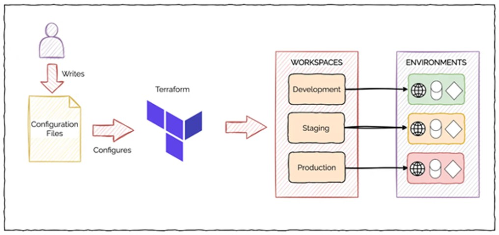
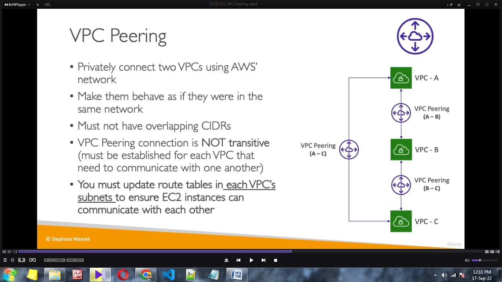

# Terraform Interview Questions & Answers

Terraform Scenario based Interview Questions

💡

Subscribe to CloudChamp Channel: https://www.y outube.com/@cloudchamp

### What is Terraform and How it works?

Terraform is an IaC tool that lets you write code to define and manage your infrastructure.

You describe your desired infrastructure in configuration files, Terraform figures out what needs to be done to achieve that state, and then it makes it happen by interacting with cloud providers or other infrastructure platforms.

**A DevOps Engineer manually created infrastructure on AWS, and now there is a requirement to use Terraform to manage it. How would you import these resources in Terraform code?**

To import existing AWS resources into Terraform, you can follow these steps:

 Write Terraform configuration for the resources you want to manage.

 Run

terraform import

identifier in AWS. For example:

terraform import aws\_instance.example i-1234567890abcdef0

command for each resource, specifying the resource type and its unique

Repeat this process for each resource you want to manage with Terraform.

Reference: https://developer.hashicorp.com/terraform/cli/commands/import

**want to use the same code for all of these environment. How can you do that?**

**You have multiple environments - dev, stage, prod for your application and you**

 **Terraform Modules** Code templates for infrastructure components. You define them once, and then you can use them with different configurations for various environments by passing in different parameters.

 **Terraform Workspaces** Provide a way to manage separate states for the same set of configuration files. Each workspace maintains its own state, allowing you to work on different environments concurrently without interfering with each other.

Reference: https://getbetterdevops.io/terraform-create-infrastructure-in-multiple-environments/

### What is the Terraform state file, and why is it important?

The Terraform state file is a JSON or binary file that stores the current state of the managed infrastructure.

State file is like a blueprint that stores information about the infrastructure you manage.

It's crucial because it helps Terraform understand what's already set up and what changes need to be made. By comparing the desired setup with the current one in the state file, Terraform can make accurate updates to your infrastructure.

**Jr DevOps Engineer accidently deleted the state file, what steps should we take to resolve this?**

Answer: If the state file is lost

 **Recover Backup** If available, restore the state file from a recent backup.

 **Recreate State** If no backup exists, manually reconstruct the state by inspecting existing

infrastructure and using for missing resources.

terraform import

 **Review and Prevent** Analyze the incident, implement preventive measures, and educate team members on best practices to avoid similar incidents in the future.

Reference: https://medium.com/version-1/recovering-from-a-deleted-terraform-state-file- 5e030c88aae0

### What are some best practices to manage terraform state file?

 **Remote Storage** Store the state file remotely (e.g., AWS S3 for safety, collaboration and version control.

 **State Locking** Enable state locking to prevent conflicts in concurrent operations.

 **Access Controls** Limit access to the state file to authorized users and services.

 **Automated Backups** Set up automated backups to prevent data loss.

 **Environment Separation** Maintain separate state files for each environment or utilize Terraform workspaces to manage multiple state files.

**Your team is adopting a multicloud strategy and you need to manage resources on both AWS and Azure using terraform so how do you structure your terraform code to handle this?**

### Terraform is cloud agnostic.

 Set up provider configurations for both AWS and Azure in separate blocks.

provider "aws" {

region = var.aws\_region

}

provider "azurerm" { features {}

subscription\_id = var.azure\_subscription\_id client\_id = var.azure\_client\_id client\_secret = var.azure\_client\_secret tenant\_id = var.azure\_tenant\_id

}

 Create Terraform code with separate modules for AWS and Azure resources.

**There are some bash scripts that you want to run after creating your resources with terraform so how would you achieve this**

You can execute scripts using the

local-exec

remote-exec

and

provisioners.

\# Execute remote Bash script after resource creation provisioner "remote-exec" {

inline = \[

"chmod +x /path/to/your/remote/script.sh", # Ensure script is executa

ble

"/path/to/your/remote/script.sh", # Execute remote script

]

connection {

\# Configure connection details such as host, username, and private key type = "ssh"

user = "your-ssh-user"

private\_key = file("/path/to/your/private-key.pem") host = aws\_instance.example.public\_ip

}

}

In this configuration, the provisioner executes Bash commands on a remote machine via

remote-exec

SSH. You need to provide the necessary connection details such as the SSH user, private key, and host. The inline script ( script.sh ) is executed on the remote machine after the resource creation.

https://y outu.be/gXl2FUBXI90

Reference: https://developer.hashicorp.com/terraform/language/resources/provisioners/syntax

**Your company is looking ways to enable HA. How can you perform blue-green deployments using Terraform?**

### Blue-Green Deployments in Terraform:

 **Concept:** Involves creating two identical environments: blue and green.

 **Implementation:** Terraform facilitates this by defining two sets of infrastructure resources with slight variations.

 **Example:** Different AWS Auto Scaling Groups or Azure Virtual Machine Scale Sets for blue and green environments.

###  Deployment Process:

 **Provisioning:** Create the new environment (green) alongside the existing one (blue).

 **Testing:** Validate the green environment to ensure it functions correctly.

 **Traffic Switching:** Update the load balancer or DNS records to route traffic from blue to green.

Reference: https://developer.hashicorp.com/terraform/tutorials/aws/blue-green-canary -tests- deployments

**Your company wants to automate Terraform through CICD pipelines. How can you integrate Terraform with CI/CD pipelines?**

Terraform can be integrated with CI/CD pipelines to automate the deployment and management of infrastructure. Here's the typical process:

 Commit the Terraform configurations to a version control system (e.g., Git).

 Set up a CI/CD pipeline that monitors changes to the Terraform code repository.

 In the pipeline, execute Terraform commands such as init, validate, and plan to ensure the configurations are valid and generate an execution plan.

 Use Terraform's apply command to create or modify infrastructure based on the approved changes.

 Optionally, leverage infrastructure testing and verification tools to validate the deployed infrastructure.

 Finally, trigger additional pipeline stages for application deployment, testing, and release.

https://y outu.be/oqOzM\_WBqZc

**Describe how you can use Terraform with infrastructure deployment tools like Ansible or Chef.**

Terraform can be used in conjunction with infrastructure deployment tools like Ansible or Chef to manage infrastructure provisioning and configuration. Ansible or Chef can handle tasks such as installing software, configuring servers, and managing services, while Terraform focuses on infrastructure provisioning and orchestration.

By combining Terraform with these tools, you can achieve a comprehensive infrastructure automation solution.

https://y outu.be/BXPsMuinvf4

**Your infrastructure contains database passwords and other sensitive information. How can you manage secrets and sensitive data in Terraform?**

Managing secrets and sensitive data in Terraform require careful consideration to ensure security. Best practices include:

 Never Hardcode secrets in your Terraform code

&#x20;Storing secrets outside of version-controlled files, using tools like HashiCorp Vault or cloud- specific secret management services.

&#x20;Utilizing Terraform input variables or environment variables to pass sensitive values securely during runtime.

By following these practices, you can protect sensitive information and minimize the risk of exposing secrets unintentionally.

**You have a RDS Database and EC2 instance. EC2 should be created before RDS, How can you specify dependencies between resources in Terraform?**

In Terraform, you can specify dependencies between resources using the attribute

within resource blocks. By including this attribute, you define an explicit ordering of resource creation and ensure that one resource is created before another. This helps manage dependencies when one resource relies on the existence or configuration of another resource.

depends\_on

Reference:

https://y outu.be/nHJX9EJy5JE

**You have 20 servers created through Terraform but you want to delete one of them. Is it possible to destroy a single resource out of multiple resources using Terraform?**

Yes, it is possible. We can use the terraform destroy -target command followed by the resource type and name to destroy a specific resource.

Here's an example:

terraform destroy -target=aws\_instance.my\_instance

In this example, only the AWS instance named resources managed by Terraform intact.

**my\_instance**

would be destroyed, leaving other

Reference: https://developer.hashicorp.com/terraform/tutorials/state/resource-targeting#destroy - y our-infrastructure

**What are the advantages of using Terraform's "count" feature over resource duplication?**

Using Terraform's " count " feature provides advantages over resource duplication by allowing you to dynamically create multiple instances of a resource based on a given condition or variable. With "count," you can define a resource block with a count value that evaluates an expression, such as a variable or a conditional statement. This reduces code duplication and enables more efficient resource management and scalability.

Reference: https://developer.hashicorp.com/terraform/language/meta-arguments/count

https://y outu.be/6LbXPPEeKXg

### What is Terraform's "module registry," and how can you leverage it?

Terraform's "module registry" is a central repository for sharing and discovering Terraform modules. The module registry allows users to publish their modules, which are reusable and shareable components of Terraform configurations.

By leveraging the module registry, you can easily discover existing modules that address your infrastructure needs, reducing duplication of effort. You can reference modules in your Terraform code using their registry URL and version.

Registry: https://registry .terraform.io/browse/modules

### How can you implement automated testing for Terraform code?

Automated testing for Terraform code can be implemented using different tools such as Terratest or tflint. These tools allow you to write test cases and execute them against your Terraform codebase.

### Automated testing :

Validates correctness of infrastructure changes  Detects issues early

Ensures desired state matches actual state Involves:

&#x20;Creating test fixtures

&#x20;Defining test scenarios

&#x20;Executing Terraform operations  Asserting expected outcomes

Tools:

 **Unit Testing** Validate individual modules with

or terratest .

terraform-compliance

Kitchen-Terraform

 **Integration Testing** Use

Terratest

 **Linting** Ensure code quality with

or

TFLint

for real/simulated environment tests.

 **Static Analysis** Detect security issues using tfsec .

or Checkov .

 **CI Integration** Automate testing in CI pipelines Jenkins, GitLab CI, GitHub Actions).

 **Mocking** Simulate dependencies with

Mockery

or Terratest Mocking .

 **Parameterized Testing** Test various scenarios with different input parameters.

 **Environment Management** Manage environments with or

Terraform Workspaces

Terraform

Cloud/Enterprise .

Reference: https://medium.com/contino-engineering/terraform-infrastructure-as-code-testing- best-practice-unit-tests-bdd-end-to-end-scenario-c30d5a6921d

**You are taskeds with migrating your existing infrastructure from terraform version 1.7 to version 1.8 so what kind of considerations and steps would you take?**

When upgrading Terraform versions:

&#x20;**Review the upgrade guide** to understand changes, deprecations, and new features.

&#x20;Update configuration files to match new syntax and handle deprecated features.  Address any breaking changes introduced in the new Terraform version.

&#x20;Ensure thorough testing in a non-production environment before applying changes in production.

&#x20;Document any changes and provide training to team members as needed.

Ensure you meet the minimum requirements, update your CI/CD pipelines, and backup your state files before starting the migration process.

https://developer.hashicorp.com/terraform/language/upgrade-guides

Terraform Interview Questions video:

AWS Interview Questions:

Terraform Scenario Based Interview Questions and Answers | DevOps Interview Terraform interview questions | Terraform Real time interview questions and answers for devops engineer | Terraform aws devops interview for freshers and experienced

In this devops video we will look at most asked Terraform interview questions along with

https://youtu.be/8oNbpS2gcx4

DevOps Interview Questions:

AWS Interview Questions and Answers 2024

AWS cloud Interview Questions | AWS devops interview questions and answers | AWS Scenario based interview questions

In this devops video we cover important aws interview questions with answers to https://youtu.be/ULiPYBLcCiw

DevOps Interview Questions and Answers for Freshers and Experienced in 2024 DevOps interviews questions and Answers | DevOps interview questions for fresher | DevOps interview questions for experienced

Are you Fresher or experienced DevOps engineer preparing for DevOps Interviews in

https://youtu.be/GX6fOvaS0Xs

What should I cover Next??

**DOCKER Interview Questions or KUBERNETES**🤔
