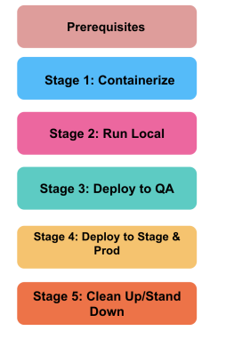

# Kubernetes Migration Process Real time

<figure><figcaption></figcaption></figure>

 

Machine and Application Prerequistes 
----------------------------------------

1. **Initial Machine Setup with Docker Desktop**&#x20;

* Familiarize with your application&#x20;
* Ldap Library Change Guide&#x20;
* How to provision secret in a Kubernetes cluster for a migrating app&#x20;

2. **Application Migration Stage 1**&#x20;

* Java App Containerization&#x20;
* Ruby App Containerization&#x20;
* RSPEC Test Containerization
* &#x20;Setting Up/Upgrade An Application Pipeline (Jenkins)&#x20;

3. **Application Migration Stage 2**&#x20;

* K8s Repo setup&#x20;
* Run Tilt&#x20;
* Tomee XML Generator&#x20;

4. **Application Migration Stage 3**&#x20;

* Add a namespace Entry&#x20;
* Deploy application into QA through argo&#x20;
* Setting Up Inbound Trac for an Application&#x20;
* Setting Up Outbound Trac for an Application&#x20;
* Switching to Legacy Proxy
* Deploy application into QA through argo&#x20;
* Setting Up Inbound Trac for an Application&#x20;
* Setting Up Outbound Trac for an Application&#x20;
* Switching to Legacy Proxy

5. **Accessing cluster**&#x20;

* Application Migration Stage 4&#x20;
* Application Migration Stage 5 

### Detailed explanation

Migrating an application to Kubernetes is a multi-stage, structured process that combines prerequisite setup, containerization, CI/CD enhancements, K8s manifest development, secret management, and progressive deployment. Drawing from senior-level real-time experience and using your reference steps, here’s how I would approach and explain a full migration:

### 1. Machine & Basic Prerequisites

* Set up Docker Desktop: Ensure Docker is running locally or on a development VM. All migration work and validation starts here.
* Understand the App: Review the architecture, dependencies (e.g., LDAP libraries), networking, storage, secrets, and how it handles scaling/failures.

### 2. Secrets & Dependencies

* Update/deprecate incompatible libraries: For example, switch to K8s-friendly LDAP packages if needed.
* Provision Secrets: Move app secrets (DB passwords, API keys) into Kubernetes Secrets objects using kubectl create secret, Helm values, or external secrets apps like HashiCorp Vault.
* Store them in base64-encoded form, define strict RBAC, and encrypt at rest via etcd for strong security.

### 3. Stage 1: Initial Containerization and CI/CD

* Containerize Each App:
* Java: Create a multi-stage Dockerfile optimizing heap, GC, and memory for the JVM. Tune the image for your cloud node pools. Test locally first.
* Ruby: Use a lightweight base image (Alpine), manage gems efficiently, and ensure proper environment configs. Test with docker-compose or locally.
* RSPEC: Build a separate image for running tests, improving pipeline efficiency.
* Set Up Jenkins Pipeline: Create or upgrade pipelines to:
* Build Docker images on every commit.
* Run tests in containers before pushing the images.
* Push to a secure registry.

### 4. Stage 2: Kubernetes Readiness

* Setup Kubernetes Repo: Create a Git repo (monorepo or split) for your K8s manifests (Deployment, Service, Ingress, ConfigMap, Secret, etc.).
* Generate Supporting Artifacts: Use internal tools (e.g., Tomee XML Generator) for app deployment needs.
* Use Tilt for Local Dev Testing: Configure Tilt to automatically build, sync, and redeploy containers when code changes, helping the dev team achieve a 'hot-reload' workflow with the cluster.

### 5. Stage 3: Namespace, Ingress, and Deployment

* Namespace Entry: Create separate namespace(s) for each environment (dev, qa, prod) for improved isolation.
* Ingress/Egress: Configure ingress rules and services, assign static DNS via Route 53, and if needed, set up legacy proxy handling to keep backward compatibility during the early cutover phase.
* Assign outbound and inbound routes for each app/microservice, using NetworkPolicy for access control.
* Deploy to QA via ArgoCD: Use ArgoCD’s declarative GitOps for cluster registration, secure access, and automated rollout.
* Push your k8s yaml/Helm chart to the Git repo; ArgoCD picks it up, applies manifests, and tracks deployment status.

### 6. Stage 4 & 5: Cutover and Go-Live

* Switching Trac & Legacy Proxy: Gradually transition inbound/outbound routes from legacy infra. Use blue-green or canary strategies if the app is customer-facing.
* Access & Validation: Ensure full cluster access, application health, real-time monitoring, and logging are active from day one (Prometheus, Grafana, ELK, CloudWatch).
* Cutover: Scale down on-prem services, fully switch DNS/traffic flow to K8s.

### Real-Time Practices & Tips

* Use Jira to track all phases, issues, and progress.
* Roll back instantly using ArgoCD, Helm, or by reverting manifests if things break.
* Automate as much as possible: Jenkins for CI/CD, Terraform/Helm for IaC.
* Instrument readiness and liveness probes in all manifests.
* Monitor secrets usage, image security (Trivy/Clair), and app health continuously.
* Share runbooks for developers to access, test, or roll forward/back in K8s.

This methodology ensures every migration step is predictable, traceable, and rapidly reversible—reflecting a robust, real-world senior DevOps approach.

 

To efficiently containerize and migrate an application to Kubernetes, a senior DevOps engineer would approach the process in a series of well-defined steps designed to minimize risk and optimize for security, operations, and scalability. Here’s a real-world, structured methodology:

### 1. Assess & Prepare the Application

* Understand the app architecture: Map dependencies, environment variables, storage needs, networking, and external integrations.
* Audit code for K8s compatibility: Address any hardcoded configs, legacy authentication (e.g., update LDAP libraries), and local file system dependencies.
* Define prerequisites: Ensure Docker is running locally, and all developers have access to code, infrastructure repos, and documentation.

### 2. Containerize the Application

* Write Dockerfiles for each app/service:
* Optimize base images (e.g., Alpine for Ruby).
* Set up best practices for security (multi-stage builds, non-root user).
* Configure environment variables and secrets: Avoid plain-text secrets; prepare for Kubernetes Secrets integration.
* Local validation: Build and run the containers with Docker Compose or similar to test the setup.

### 3. Build Robust CI/CD Pipelines

* Set up or upgrade CI pipelines (Jenkins, GitHub Actions, etc.):
* Automate build, test (unit/integration/RSPEC), and Docker image creation on every change.
* Integrate static analysis, vulnerability scans (Snyk/Trivy), and enforce quality gates.
* Push artifacts to a secure container registry (ECR, GCR, etc.).

### 4. Develop Kubernetes Manifests & GitOps Structure

* Create K8s manifests or Helm charts: Define Deployments, Services, ConfigMaps, Secrets, Ingress, and resource limits.
* Create namespaces for isolation: E.g., dev, test, prod.
* Version control: Store all K8s-related YAML/Helm files in a dedicated Git repo for traceability and peer review.

### 5. Secrets & Config Management

* Provision secrets: Store API keys, DB passwords in Kubernetes Secrets or integrate with external secret management (e.g., HashiCorp Vault).
* Ensure secure access: Use RBAC to control secret access, encrypt etcd at rest, and audit secret usage.

### 6. Staged Deployment & Validation

* Set up local dev experience (optional): Use tools like Tilt or Skaffold for iterative local development synced with K8s.
* Deploy initial version to non-prod: Use ArgoCD or similar GitOps tools to deliver the manifests to a QA namespace.
* Smoke testing & rollback: Validate functionality, readiness/liveness probes, and log output; automate rollback pipelines for safe failure handling.

### 7. Network & Traffic Management

* Ingress/Egress setup: Define how traffic enters/exits—set up DNS records, Ingress controllers (NGINX, ALB), and any legacy proxy integration if needed.
* NetworkPolicy: Restrict internal traffic between services for security.

### 8. Go-Live & Post-Migration

* Cutover planning: Use deployment strategies such as blue-green or canary to minimize risk during switch-over to K8s.
* Monitoring & Observability: Integrate with Prometheus, Grafana, ELK, or AWS CloudWatch from day one for metrics, logs, and alerting.
* Validate & Optimize: Tune resource limits, scale policies, and monitor application health and cluster performance.

### Best Practices

* Document everything: Use Jira/Confluence for ticket and knowledge management.
* Automate infra as much as possible: Use Terraform/CloudFormation for K8s and cloud resources.
* Regular security audits: Container image scans, Kubernetes RBAC reviews, secrets rotation policies.
* Roll back quickly: Leverage ArgoCD/Helm history to revert bad releases instantly.

Following these disciplined steps ensures efficient, predictable, and secure containerization and migration of apps to Kubernetes, reflecting strong hands-on leadership and operational maturity.

 
